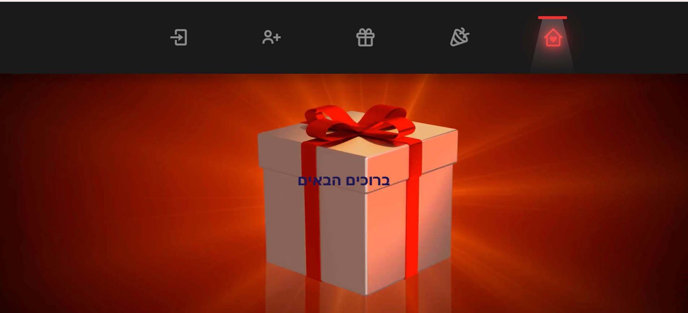
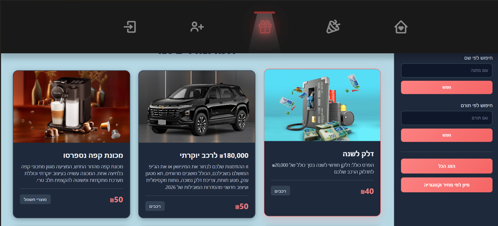
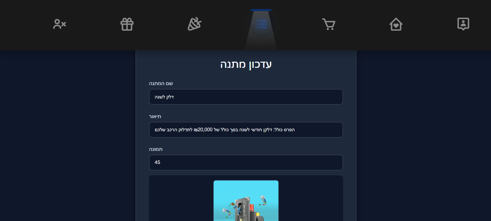
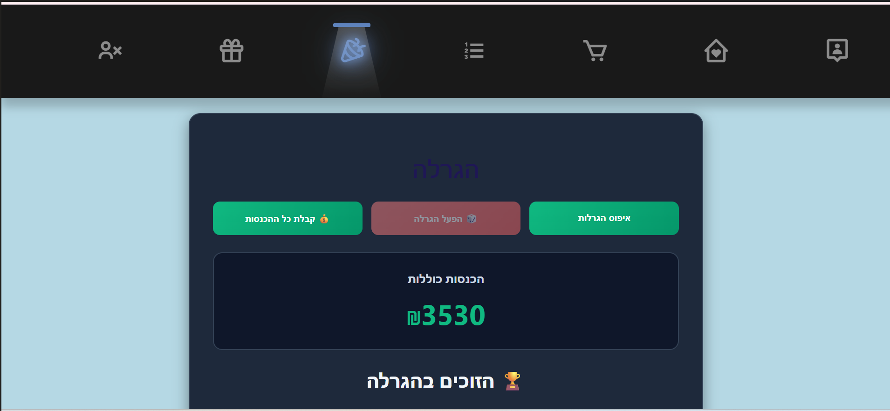
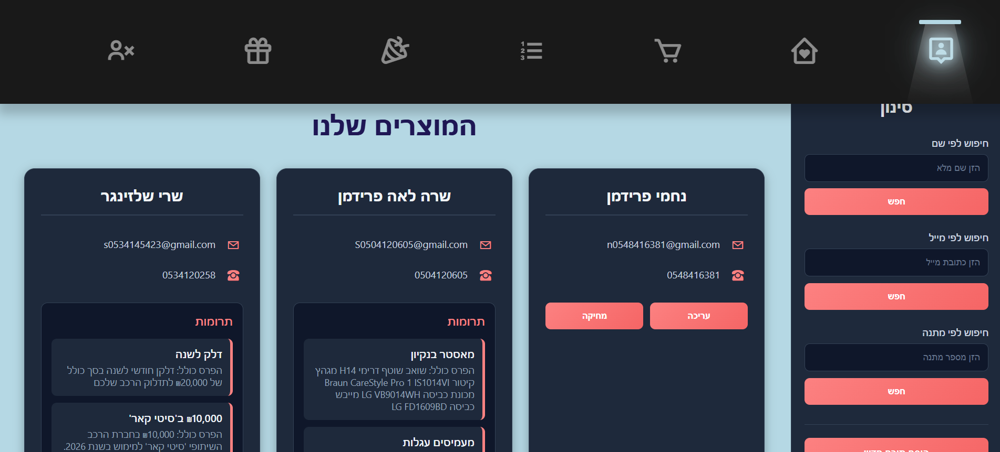

# 🎁 Mechira Sinit

<p align="center">
  
</p>

<p align="center">
  A full-stack Chinese auction management system built with Angular and ASP.NET Core Web API.
</p>

---

# 🛠️ Built With

<p align="center">


</p>

---

# 📌 About The Project

**Mechira Sinit** is a full-stack web application for managing a Chinese auction system.

The system allows guests to browse available gifts, while registered users can add gifts to their basket and create orders.

An administrator manages gifts, user permissions, and controls the lottery process. The lottery is activated manually by the administrator and winners are selected randomly.

---

# ✨ Features

## 👤 Guest Users

* Browse available gifts
* View gift details without registration

## 🛒 Registered Users

* User authentication
* Add gifts to basket
* Create orders
* Participate in the Chinese auction

## 👑 Administrator

* Manage gifts
* Manage permissions
* Control the lottery process
* Run random winner selection

---

# 🖼️ Screenshots

## 🏠 Home Page

<p align="center">
  
</p>

---

## 🎁 Gifts Page

<p align="center">
  
</p>

---

## 🛒 Shopping Basket

<p align="center">
  
</p>

---

## 🔐 Login

<p align="center">
  
</p>

---

## 👑 Admin Management

<p align="center">
  
</p>

---

## 🎲 Lottery

<p align="center">
  
</p>

---

## 🤝 Donors

<p align="center">
  
</p>

---

# 🏗️ Architecture

```text
                 Angular Client
                       |
                       |
              HTTP Requests + JWT
                       |
                       |
             ASP.NET Core Web API
                       |
                       |
            Entity Framework Core
                       |
                       |
              SQL Server Database
```

---

# 📂 Project Structure

```text
MechiraSinit/
│
├── client/
│   └── Angular Frontend
│
└── server/
    └── ASP.NET Core Web API Backend
```

---

# ⚙️ Backend Architecture

The backend is organized using a layered architecture:

### Controllers

Responsible for handling HTTP requests and API endpoints.

### Services

Contains the business logic of the application.

### Repository Pattern

Separates data access logic from business logic.

### DTOs

Used for transferring data between the client and server.

### Entity Framework Core

Handles database communication and migrations.

---

# 🔐 Authentication & Authorization

The system uses JWT authentication to securely manage users and protect API requests.

Different permissions are applied according to user roles:

* Regular users can create orders and participate in the auction.
* Administrators can manage gifts and run the lottery.

---

# 🗄️ Database

The project uses **SQL Server** with **Entity Framework Core**.

Main entities:

* Users
* Gifts
* Donors
* Orders
* Lottery
* Categories

---

# 🚀 Installation

## Backend

Navigate to the server folder:

```bash
cd server
```

Restore dependencies:

```bash
dotnet restore
```

Run the server:

```bash
dotnet run
```

---

## Frontend

Navigate to the client folder:

```bash
cd client
```

Install dependencies:

```bash
npm install
```

Run Angular:

```bash
ng serve
```

The application will run on:

```text
http://localhost:4200
```

---

# 📚 API Documentation

Swagger is integrated into the backend to provide interactive API documentation and allow testing of endpoints.

---

# 💻 Development Tools

* Visual Studio
* Visual Studio Code
* Git & GitHub

---

# 👩‍💻 Author

**Efrat-Fr**
